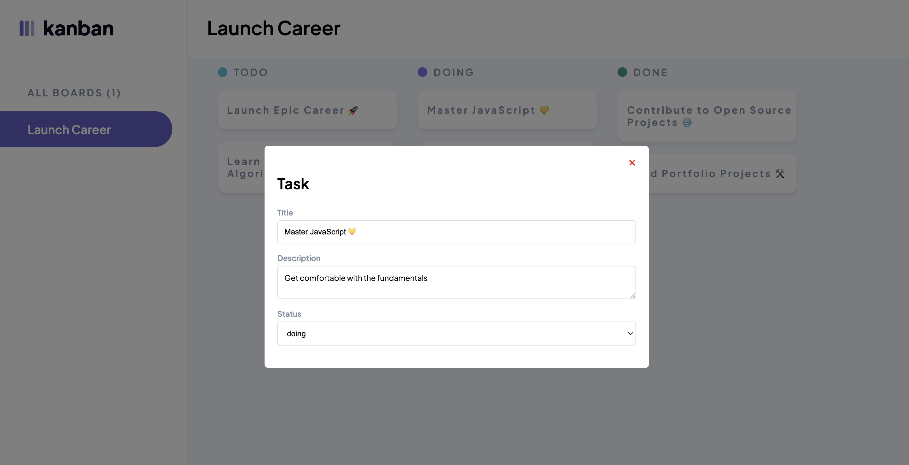
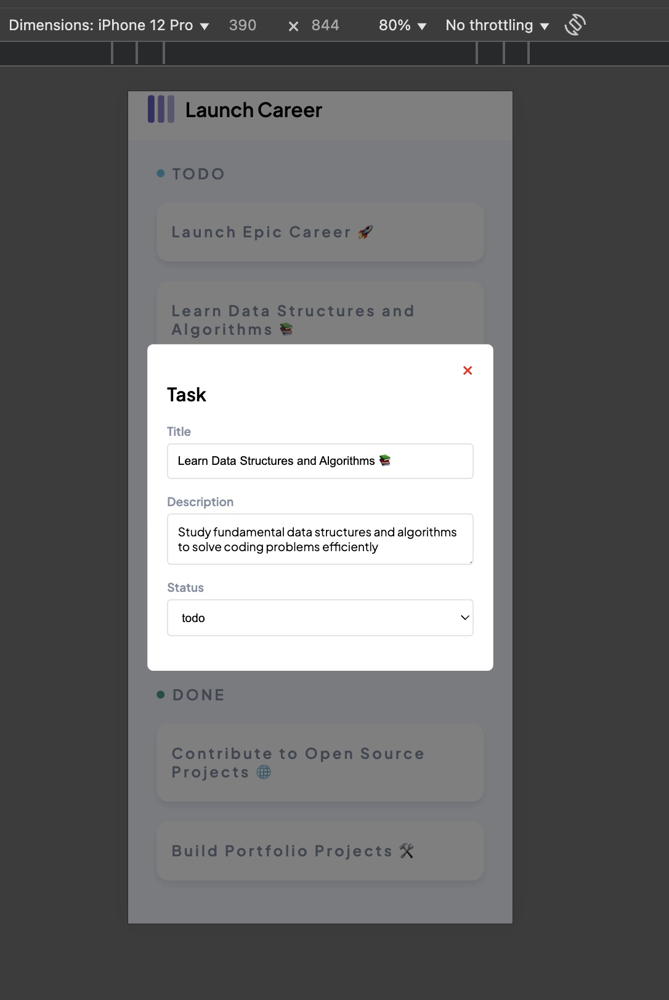

# Dynamic Kanban Task Board

A dynamic task management system built using HTML, CSS, and JavaScript. Tasks are displayed on a **Kanban-style board** with three columns: **To Do**, **Doing**, and **Done**. Users can click a task to view and edit its details in a **modal**, following a clean, modular JavaScript structure.

## 🚀 Features

#### Dynamic Task Display
- Generate task elements dynamically from initial data.
- Place tasks into correct Kanban columns (`To Do`, `In Progress`, `Done`) based on status.
- Modular JavaScript functions for creating tasks, rendering tasks, and handling events.

#### Modal Interaction
- Click a task to open a modal displaying its title, description, and status.
- Editable inputs for task title and description.
- Status dropdown to change the task's current status.
- Close button to exit the modal.
- Responsive modal with backdrop effect for focus.

## 🛠️ Technologies Used

- HTML5  
- CSS3 (Flexbox/Grid for layout, responsive design)  
- JavaScript (DOM manipulation, event handling) 

## 📁 Folder Structure

project-root/
├── index.html       # Main HTML file  
├── styles.css       # Styling for the board and modal  
├── script.js        # JavaScript logic for tasks and modal  
├── assets/          # Logos, icons, and favicons  
├── images/          # Screenshots for documentation  
└── README.md        # Project documentation  

## Figma Design

Check the updated Figma design for reference: [Figma Link](https://www.figma.com/design/y7bFCUYL5ZHfPeojACBXg2/Challenges-%7C-JSL?node-id=6033-10647&t=sFVwb6fEmRK8u8El-0)

## 🧪 How to Run

1. Clone or download the repository.
2. Open `index.html` in your browser.
3. The task board will render dynamically from the initial task data.
4. Click any task to open the modal and edit details.
5. Check browser Developer Tools → Console for debugging

## 📸 Screenshots
###### Example of modal view on a desktop

###### Example of modal view on a 

## 🧑‍💻 Author

Created by _Ayabonga Mtsotso_

---